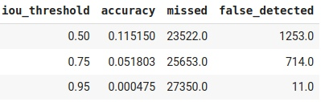

#### Image example  

  
Из приведенных примеров можно сделать вывод, что для детекция мелких объектов для сети является трудностью. Большое скопление объектов одного типа группируется в один большой бокс, как на первом и втором рисунках.
#### Tables
В тестовом датасете большая часть рамеченых мелких объектов, думаю, что именно это сказалось на точности детектирования.  
  
  
 
  